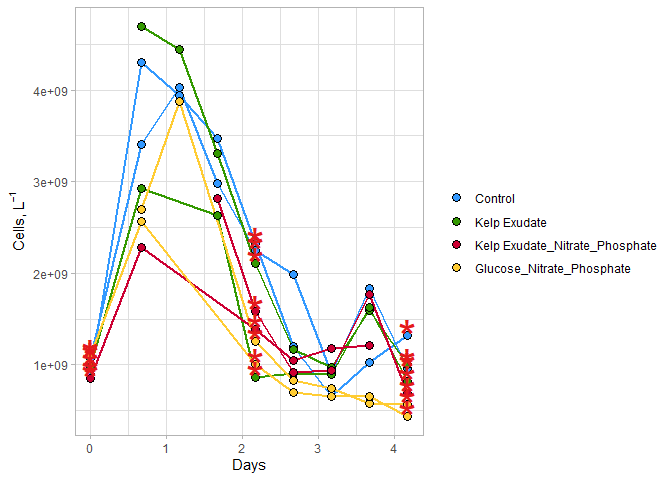
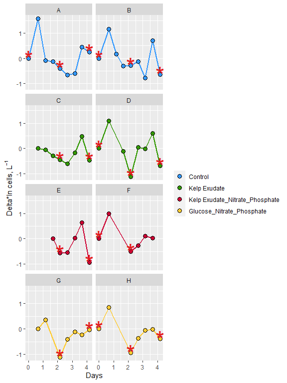
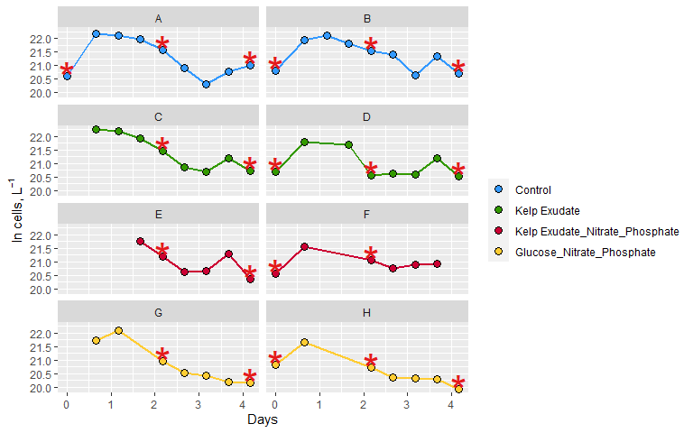

2021\_Bac\_Abundance
================
Ally Doolittle
10/20/2021

# Goal

**Objective:** Visualize our data and identify exponential growth.

\#Intro to R Markdown

Create a new code chunk: PC - Ctrl + alt + i

Load packages that we’ll need to analyze our data

``` r
library(tidyverse)
library(readxl)
library(lubridate)
```

We can toggle on/off warnings in chunks if we don’t want them in our
final markdown file

# Import Data

``` r
excel_sheets("144L_2021_BactAbund.xlsx")


metadata <- read_excel("144L_2021_BactAbund.xlsx", sheet = "Metadata")

glimpse(metadata)

#unique(metadata$Bottle)
#unique(metadata$Treatment)

data <- read_excel("144L_2021_BactAbund.xlsx", sheet = "Data")

glimpse(data)

joined <- left_join(metadata, data) #attach data to metadata
#joins right dataset to the left one by using variables that are the same across the two dataframes

#glimpse(joined)
```

# Prepare data

we will convert the Date and Time column values from characters to
dates, add columns with time elapsed for each treatment, and convert to
cells/L because it will help us match up with the TOC data later. We
will then subset the data for variables of interest and drop NA values.

To do this we are going to use **piping**. Piping is an operation that
allows us to write more efficient code. The way that we’ll use it here
is to manipulate our data sequentially. The pipe operator “%&gt;%, which
basically says like”first do one thing to the data, THEN do this other
thing." (with the %&gt;% operator taking the place of the word THEN in
this scenario). Every cell that we invoke with an additional pipe is
going to take place on the variable (dataframe) that we specify at the
beginning

# Plot Growth Curves

We will plot a growth curve for each bottle. Need cell abundance and
days data.

First let’s set some aesthetics for our plot.

<!-- -->

# Next Steps

We can calculate:

-total change in cells from initial condition to the end of the
experiment. -specific growth rate as the slope of ln(abundance) v time
during exponential growth phase. -doubling time as ln(2) divided by the
specific growth rate. -mean of each of these parameters across each
treatment

1st, we need to determine **where** exponential growth is ocurring in
each of our bottles, if it does. To do this, we’ll plot ln(abundance) vs
time.

# Identify Exponential Phase of Growth of Our Remineralization Experiments

**NOTE about logarithms in R**

log(x) gives the natural log of x, not log base 10 log10(x) gives the
log base 10 log2(x) gives log base 2

Now let’s plot our newly calculated data!

<!-- -->

Exponential growth seems to be occurring right at the beginning of the
experiment between 0-1 days for most of the bottles.

Let’s try plotting ln\_cells to see if that can help us identify
exponential growth in the control a little better.

<!-- -->
ln data showing exponential growth at the beginning of the experiment
for most of the bottles.

**Summary:** Prepared data sets for plotting then learned ggplot.
Plotted growth curves for our remineralization experiment. Also added
colors and layers to the plots to more efficiently visualize the data.
Plotted ln and ln(abundance) to identify where exponential growth
occurred.
